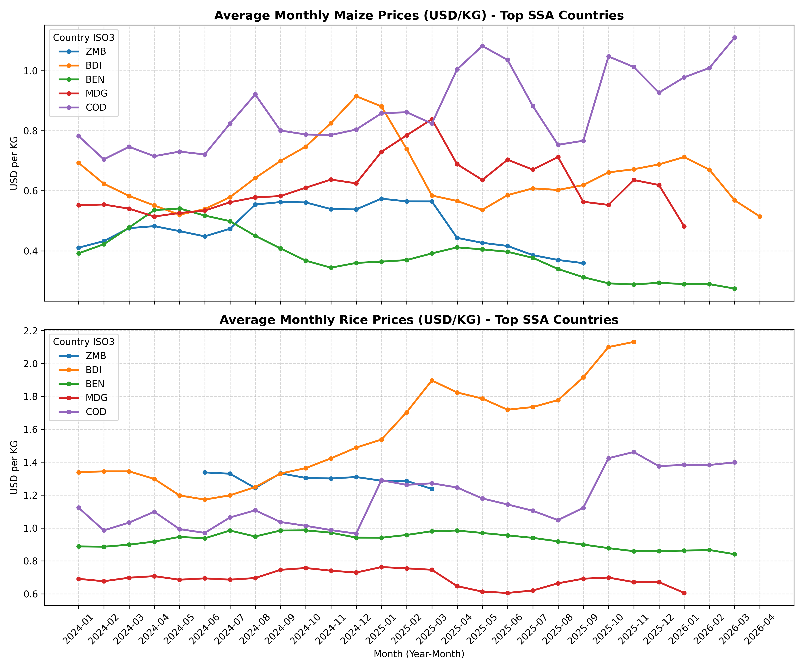

# Sub-Saharan Africa Agricultural Price Trend Report

*Generated automatically on: 2026-07-05 19:24:27*

This report monitors and visualizes retail and wholesale prices for **Maize** and **Rice** in sub-Saharan Africa. The data source is the WFP Global Food Prices Database.

---

## Price Trend Visualization

---

## Recent Monthly Price Analysis

### Recent Maize Prices by Country

| Country (ISO3) | Latest Month | Current Price (USD/KG) | Previous Month Price | Monthly Change | Trend |
|---|---|---|---|---|---|
| BDI | 2026-04 | $0.514 | $0.568 | -0.054 (-9.5%) | 📉 |
| BEN | 2026-03 | $0.274 | $0.289 | -0.015 (-5.1%) | 📉 |
| BFA | 2026-04 | $0.311 | $0.311 | +0.000 (+0.1%) | ➖ |
| CAF | 2026-03 | $0.331 | $0.295 | +0.036 (+12.1%) | 📈 |
| CIV | 2026-04 | $0.430 | $0.510 | -0.080 (-15.7%) | 📉 |
| CMR | 2026-03 | $0.349 | $0.374 | -0.025 (-6.7%) | 📉 |
| COD | 2026-03 | $1.110 | $1.009 | +0.101 (+10.0%) | 📈 |
| ETH | 2026-03 | $0.400 | $0.363 | +0.037 (+10.2%) | 📈 |
| GIN | 2026-03 | $0.917 | $0.916 | +0.002 (+0.2%) | ➖ |
| GMB | 2026-01 | $0.834 | $0.833 | +0.001 (+0.2%) | ➖ |
| GNB | 2025-11 | $1.342 | $1.569 | -0.227 (-14.5%) | 📉 |
| KEN | 2026-04 | $0.587 | $0.541 | +0.046 (+8.6%) | 📈 |
| LSO | 2026-03 | $0.499 | $0.534 | -0.034 (-6.4%) | 📉 |
| MDG | 2026-01 | $0.481 | $0.619 | -0.138 (-22.2%) | 📉 |
| MLI | 2026-03 | $0.406 | $0.438 | -0.032 (-7.4%) | 📉 |
| MOZ | 2026-03 | $0.713 | $0.714 | -0.001 (-0.1%) | ➖ |
| MRT | 2026-04 | $0.780 | $0.743 | +0.037 (+5.1%) | 📈 |
| MWI | 2026-04 | $0.515 | $1.016 | -0.501 (-49.3%) | 📉 |
| NER | 2026-04 | $0.361 | $0.347 | +0.015 (+4.3%) | 📈 |
| NGA | 2026-04 | $0.570 | $0.521 | +0.049 (+9.4%) | 📈 |
| RWA | 2026-05 | $0.528 | $0.566 | -0.038 (-6.7%) | 📉 |
| SEN | 2026-03 | $0.476 | $0.487 | -0.011 (-2.3%) | 📉 |
| SLE | 2026-03 | $1.773 | $1.632 | +0.141 (+8.6%) | 📈 |
| SOM | 2026-04 | $1.182 | $1.077 | +0.106 (+9.8%) | 📈 |
| SSD | 2026-05 | $6.265 | $6.001 | +0.265 (+4.4%) | 📈 |
| SWZ | 2026-02 | $0.890 | $0.827 | +0.063 (+7.7%) | 📈 |
| TCD | 2026-02 | $0.398 | $0.378 | +0.019 (+5.1%) | 📈 |
| TZA | 2026-03 | $0.332 | $0.330 | +0.002 (+0.6%) | ➖ |
| UGA | 2026-04 | $0.654 | $0.585 | +0.069 (+11.8%) | 📈 |
| ZMB | 2025-09 | $0.359 | $0.369 | -0.011 (-2.9%) | 📉 |
| ZWE | 2024-03 | $0.085 | $0.057 | +0.029 (+51.1%) | 📈 |

### Recent Rice Prices by Country

| Country (ISO3) | Latest Month | Current Price (USD/KG) | Previous Month Price | Monthly Change | Trend |
|---|---|---|---|---|---|
| BDI | 2025-11 | $2.131 | $2.099 | +0.031 (+1.5%) | 📈 |
| BEN | 2026-03 | $0.840 | $0.866 | -0.026 (-3.0%) | 📉 |
| BFA | 2026-04 | $0.774 | $0.763 | +0.011 (+1.4%) | 📈 |
| CAF | 2026-03 | $1.779 | $1.931 | -0.152 (-7.9%) | 📉 |
| CIV | 2026-04 | $0.855 | $0.847 | +0.008 (+0.9%) | ➖ |
| CMR | 2026-03 | $0.835 | $0.859 | -0.024 (-2.7%) | 📉 |
| COD | 2026-03 | $1.399 | $1.383 | +0.016 (+1.1%) | 📈 |
| COG | 2026-02 | $1.153 | $1.000 | +0.153 (+15.3%) | 📈 |
| DJI | 2025-12 | $0.700 | $0.706 | -0.006 (-0.8%) | ➖ |
| ETH | 2026-03 | $0.911 | $0.910 | +0.001 (+0.1%) | ➖ |
| GIN | 2026-03 | $0.870 | $0.893 | -0.024 (-2.7%) | 📉 |
| GMB | 2026-01 | $1.121 | $1.116 | +0.005 (+0.4%) | ➖ |
| GNB | 2025-11 | $0.893 | $0.931 | -0.038 (-4.1%) | 📉 |
| KEN | 2026-04 | $0.877 | $1.002 | -0.125 (-12.5%) | 📉 |
| LBR | 2025-07 | $0.685 | $0.696 | -0.010 (-1.5%) | 📉 |
| MDG | 2026-01 | $0.605 | $0.671 | -0.066 (-9.8%) | 📉 |
| MLI | 2026-03 | $0.819 | $0.914 | -0.095 (-10.4%) | 📉 |
| MOZ | 2026-03 | $0.970 | $0.923 | +0.047 (+5.1%) | 📈 |
| MRT | 2026-04 | $1.016 | $0.999 | +0.017 (+1.7%) | 📈 |
| MWI | 2026-03 | $2.237 | $2.208 | +0.029 (+1.3%) | 📈 |
| NER | 2026-04 | $0.875 | $0.837 | +0.038 (+4.5%) | 📈 |
| NGA | 2026-04 | $0.928 | $0.886 | +0.042 (+4.8%) | 📈 |
| RWA | 2026-05 | $0.969 | $0.991 | -0.022 (-2.2%) | 📉 |
| SEN | 2026-03 | $0.712 | $0.745 | -0.033 (-4.5%) | 📉 |
| SLE | 2026-03 | $0.824 | $0.791 | +0.033 (+4.1%) | 📈 |
| SOM | 2026-04 | $1.209 | $1.003 | +0.206 (+20.5%) | 📈 |
| SSD | 2025-12 | $2.262 | $2.216 | +0.046 (+2.1%) | 📈 |
| SWZ | 2026-02 | $1.080 | $1.017 | +0.063 (+6.2%) | 📈 |
| TCD | 2026-02 | $0.992 | $0.951 | +0.040 (+4.2%) | 📈 |
| TZA | 2026-03 | $1.012 | $1.008 | +0.003 (+0.3%) | ➖ |
| ZMB | 2025-03 | $1.238 | $1.286 | -0.048 (-3.8%) | 📉 |
| ZWE | 2024-03 | $0.170 | $0.091 | +0.079 (+87.0%) | 📈 |

> [!NOTE]
> * Prices reflect WFP local retail/wholesale price data converted to USD equivalent per KG.
> * Trend indicator threshold is set at a 1.0% change relative to the previous observation month.
> * `📈` indicates price increase, `📉` indicates price decrease, and `➖` represents price stability (within +/- 1.0%).

## Data Insights and Summary

* **Maize**: Displays high geographic price variance. Prices are heavily influenced by local harvests, transport costs, and cross-border trade policies.
* **Rice**: Rice exhibits more uniform pricing across countries, as it is heavily imported from global markets (e.g. Southeast Asia) and tied to international pricing benchmarks.

*Cleaned source data file is available at: [cleaned_prices.csv](data/cleaned_prices.csv)*
