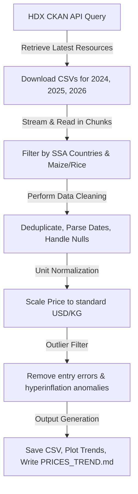

# Autonomous Agricultural Price Data Pipeline

This repository hosts a fully automated, end-to-end data pipeline that scrapes, cleans, normalizes, and visualizes price data for **Maize** and **Rice** across **sub-Saharan Africa (SSA)**. 

The pipeline fetches real-time and historical price observations from the World Food Programme (WFP) Global Food Prices database via the Humanitarian Data Exchange (HDX) CKAN API.

---

## 🛠️ How It Works (Pipeline Workflow)

The automated pipeline performs the following sequential stages:



1. **Dynamic Scrapes**: Programmatically queries the CKAN API for the `global-wfp-food-prices` package, identifying and downloading the CSV datasets for the most recent years (2024, 2025, and 2026).
2. **Chunk-based Streaming**: Stream-downloads and processes the files chunk-by-chunk using `pandas` to maintain a low memory footprint (~128 MB of source data is processed efficiently).
3. **Data Cleaning & Deduplication**:
   - Discards records missing date, price, or commodity information.
   - Standardizes coordinate and price fields to numeric types.
   - Deduplicates observations.
4. **Unit Weight Normalization**:
   - Converts wholesale/retail package sales (e.g. `100 KG`, `90 KG`, `50 KG`, `25 KG`, `3.5 KG` bags) to standard **Price per KG** rates.
   - Rectifies database listing errors (e.g. Somalia `KG` rows which are actually `50 KG` bag prices).
5. **Outlier Filtering**: Excludes extreme price outliers (prices above $8.00/KG or below $0.01/KG) to eliminate hyperinflation currency conversions and human typing errors.
6. **Visualization & Reporting**:
   - Creates a dual-plot monthly trend chart for Maize and Rice for the top 5 countries.
   - Outputs the final report `PRICES_TREND.md` with monthly statistical tables and direction indicators (📈/📉/➖).

---

## 📂 Project Structure

```
.
├── main.py                # Pipeline entry point
├── pipeline.py            # Core scraping, cleaning, plotting, and reporting logic
├── pyproject.toml         # Python packaging and dependency specifications
├── .gitignore             # Git exclusion rules (ignores virtualenv, caches)
├── PRICES_TREND.md        # Generated visual trend report
└── data/
    ├── cleaned_prices.csv # Cleaned, normalized historical price dataset (USD/KG)
    └── price_trends.png   # Trend line chart of monthly average prices
```

---

## 🚀 Getting Started

### 📋 Prerequisites
- Python **3.9+** (verified on macOS Python 3.9.6)

### ⚙️ Installation & Setup
1. Clone the repository and navigate to the project directory:
   ```bash
   git clone https://github.com/iPablo26/autonomous-agri-price-pipeline.git
   cd autonomous-agri-price-pipeline
   ```

2. Create a virtual environment:
   ```bash
   python3 -m venv .venv
   ```

3. Upgrade pip and install dependencies:
   ```bash
   .venv/bin/pip install --upgrade pip
   .venv/bin/pip install pandas requests matplotlib
   ```

### 🏃 Running the Pipeline
Execute the main entry point to trigger the automated scraper, cleaning routine, and visual report generation:
```bash
.venv/bin/python main.py
```

After completion, you will find:
- A clean consolidated dataset in `data/cleaned_prices.csv`
- A monthly trend plot in `data/price_trends.png`
- A detailed markdown report in `PRICES_TREND.md`